# Sistema de empleados en Laravel

Este proyecto simula un sistema de recursos humanos para gestionar una lista de empleados, permitiendo crear, editar y eliminar registros. Está desarrollado en Laravel y utiliza herramientas como XAMPP, Composer, Node.js y Bootstrap.

## Herramientas utilizadas

- **XAMPP**: Servidor local para ejecutar el proyecto.
- **Composer**: Para la gestión de dependencias de PHP.
- **Node.js**: Para manejar dependencias de JavaScript y utilizar Bootstrap.
- **Bootstrap**: Framework CSS para diseñar la interfaz.

## Funcionalidades principales

- **Creación de empleados**: Se pueden añadir nuevos registros de empleados al sistema.
- **Edición de empleados**: Permite actualizar la información de los empleados ya registrados.
- **Eliminación de empleados**: Los registros de empleados pueden ser eliminados del sistema.
- **Validación de datos**: Se valida la entrada de datos antes de guardarlos en la base de datos para asegurar la calidad de la información.
- **Mensajes de confirmación**: Los mensajes de texto son gestionados mediante sesiones, mostrando notificaciones al usuario sobre el éxito o error de las acciones realizadas.

## Estructura del proyecto

- **Vistas**: El proyecto está estructurado utilizando las convenciones de Laravel para organizar las vistas de forma limpia y accesible.
- **Rutas**: Las rutas están definidas para gestionar cada acción del CRUD.
- **Formulario de entrada**: Se recepcionan los datos de los empleados mediante formularios que validan la información antes de guardarla o actualizarla en la base de datos.

## Implementación

1. **Creación de vistas**: Se estructuraron las vistas para mostrar el listado de empleados, formularios para crear y editar, y botones para eliminar.
2. **Recepción y validación de datos**: Los formularios reciben los datos de los empleados y se validan utilizando el método `validate` de Laravel.
3. **Interacción con la base de datos**: Los datos se guardan, editan y eliminan en la base de datos utilizando el modelo de Eloquent de Laravel.
4. **Mensajes de texto**: Se implementaron mensajes de texto utilizando sesiones para mostrar confirmaciones o errores tras realizar acciones como la creación, edición o eliminación.

## Capturas de pantalla

Podes ver las capturas de pantalla del proyecto en los siguientes estados:
- **Login**

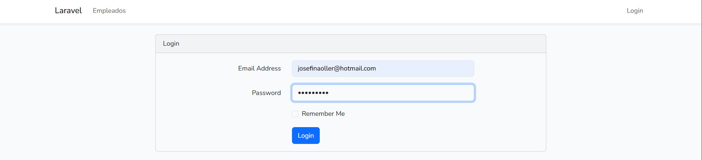
*Captura de pantalla de login*

- **Creación de empleado**

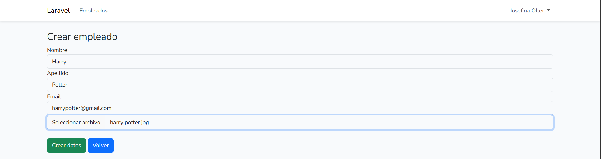
*Captura de pantalla de la creación de empleado*

*Captura de pantalla del mensaje exitoso sobre la creación de empleado*

- **Edición de empleado**

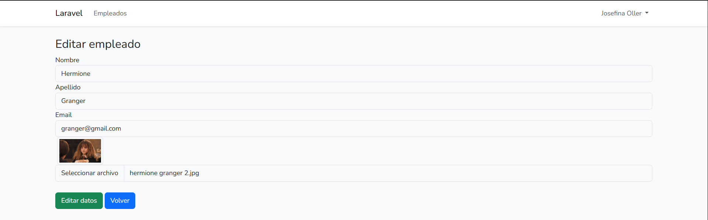
*Captura de pantalla de la edición de empleado, cambiando el email y la foto*

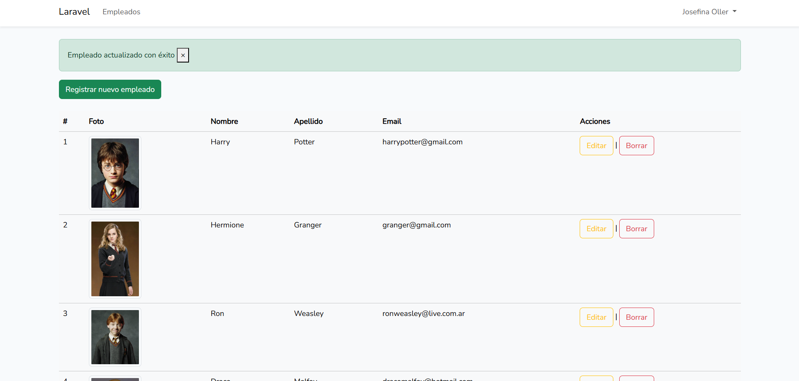
*Captura de pantalla del mensaje exitoso sobre la edición de empleado*

- **Lista de empleados**

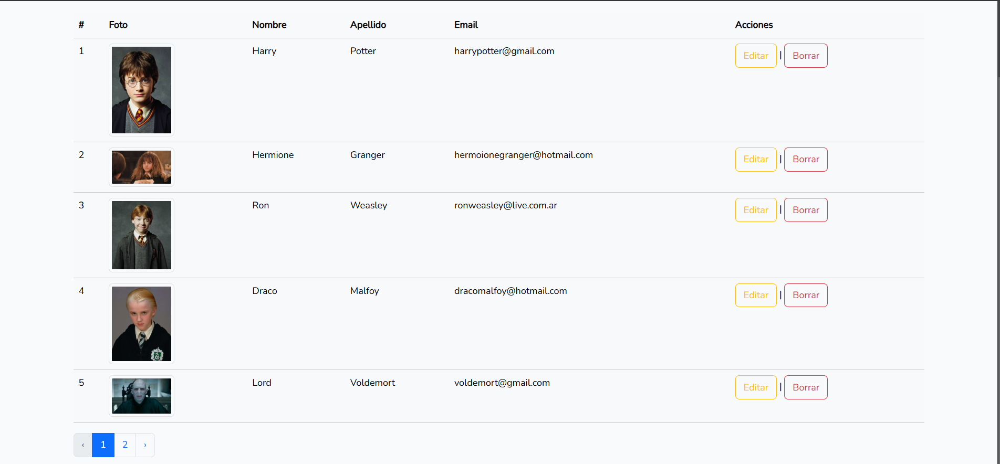
*Captura de pantalla de la lista de empleados con paginación*

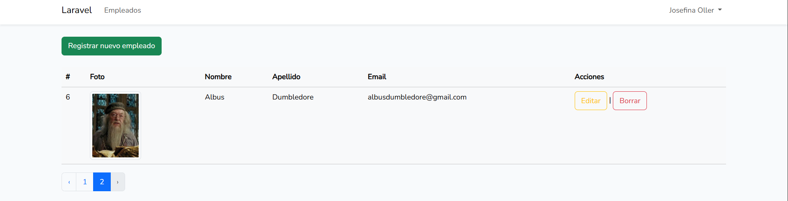
*Captura de pantalla de la lista de empleados en la segunda página*

- **Eliminación de empleado**

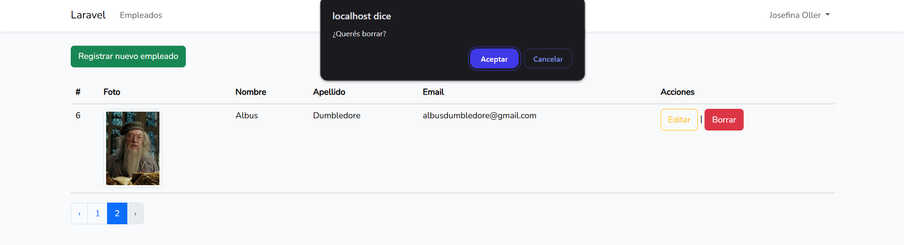
*Captura de pantalla de la consulta para eliminar empleado*

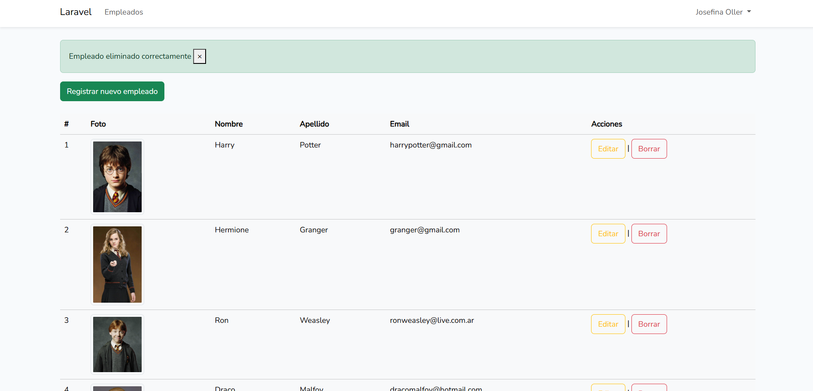
*Captura de pantalla del mensaje exitoso sobre la eliminación de empleado*

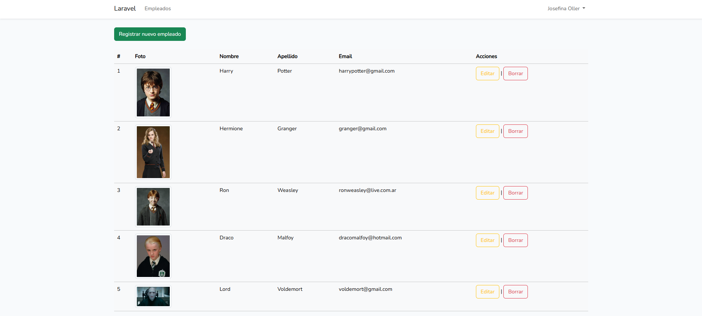
*Captura de pantalla de la lista de empleados actualizada después de la eliminación*

- **Validación de datos**

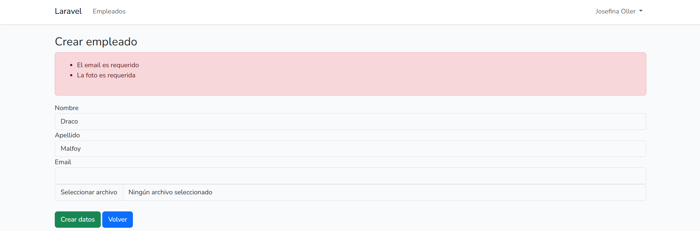
*Captura de pantalla de la validación de datos durante la creación de empleado*

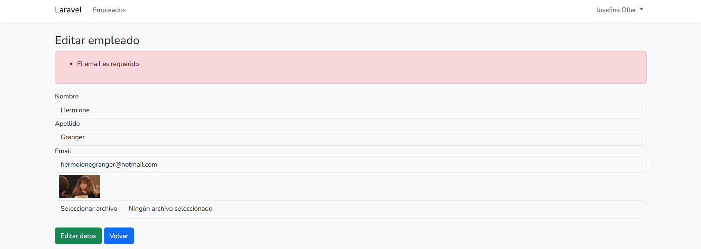
*Captura de pantalla de la validación de datos durante la edición de empleado*