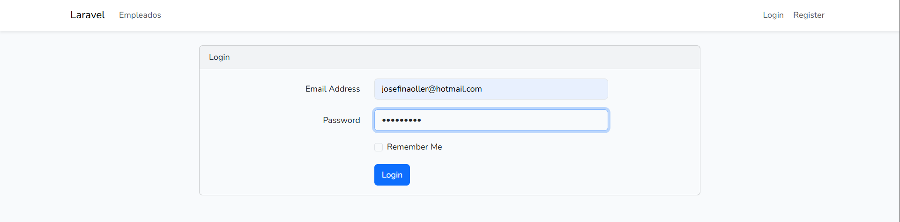
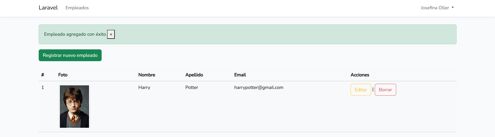

# 🚀 Sistema de Empleados en Laravel

¡Bienvenido al **sistema de recursos humanos más eficiente y amigable** de todos los tiempos! 👩‍💼👨‍💼 Con este proyecto podrás crear, editar y eliminar empleados como todo un **pro**. Todo eso, mientras disfrutas de una interfaz limpia y moderna que no te hará perder tiempo. 😎

## 🛠️ Herramientas utilizadas

- **XAMPP**: El servidor local que nunca te abandona. 😌
- **Composer**: El mejor amigo de cualquier proyecto PHP. 🔧
- **Node.js**: Para manejar las dependencias JavaScript y hacer magia con Bootstrap. 💻✨
- **Bootstrap**: Porque todos necesitamos algo bonito, rápido y responsivo. 💅

## 💼 Funcionalidades principales

- **Creación de empleados**: ¡Añadir nuevos miembros al equipo nunca fue tan fácil! 👥
- **Edición de empleados**: Cambia la información cuando sea necesario. No hay vuelta atrás... o sí. ✏️
- **Eliminación de empleados**: ¿Algún empleado en la lista ya no pertenece a la empresa? ¡Elimínalo sin piedad! 🧨
- **Validación de datos**: La calidad importa, por eso validamos todo antes de guardarlo. ✅
- **Mensajes de confirmación**: Porque todo gran esfuerzo merece un aplauso... o al menos un mensaje. 🎉

## 🗂️ Estructura del proyecto

- **Vistas**: Están organizadas como un equipo de trabajo bien disciplinado. ¡Todo tiene su lugar! 🗂️
- **Rutas**: Cada acción tiene su propia ruta, como un GPS para tu CRUD. 🛣️
- **Formulario de entrada**: Los datos de los empleados entran y se validan con estilo. 🎯

## ⚡ Implementación

1. **Creación de vistas**: Organizadas y elegantes, como cualquier oficina moderna. 💼
2. **Recepción y validación de datos**: Validamos cada entrada como si fuéramos un jefe que no perdona detalles. 🧐
3. **Interacción con la base de datos**: Guardamos, editamos y eliminamos datos como si tuviéramos un asistente superrápido. 🖥️
4. **Mensajes de texto**: Usamos sesiones para mostrarte mensajes que te harán sentir como un superhéroe. 💬🦸‍♀️

## 📸 Capturas de pantalla

Aquí tenés una muestra visual de todo lo que este sistema puede hacer:

- **Login**

  
*¡Bienvenido! La puerta de la oficina está abierta.* 🔑

- **Creación de empleado**

  
*¡Agregar a un nuevo miembro al equipo es fácil!* 🙌

  
*Confirmación de que la incorporación fue todo un éxito.* 🏆

- **Edición de empleado**

  
*Editar un empleado, porque hasta los mejores pueden necesitar ajustes.* ✏️

  
*¡Todo actualizado con éxito!* ✅

- **Lista de empleados**

  
*La lista de empleados organizada, como un buen archivo. 📑*

  
*Y si hay más empleados, siempre hay una segunda página.* 📄

- **Eliminación de empleado**

  
*¿Seguro de eliminar? Siempre hay que confirmar.* ⚠️

  
*¡Eliminado con éxito! Esos empleados no sabían lo que les esperaba.* 🔥

  
*Y la lista se actualiza instantáneamente.* ✨

- **Validación de datos**

  
*Si algo no está bien, ¡te lo avisamos! No hay lugar para errores.* ⚡

  
*La validación nunca descansa, como un buen jefe.* 🧐